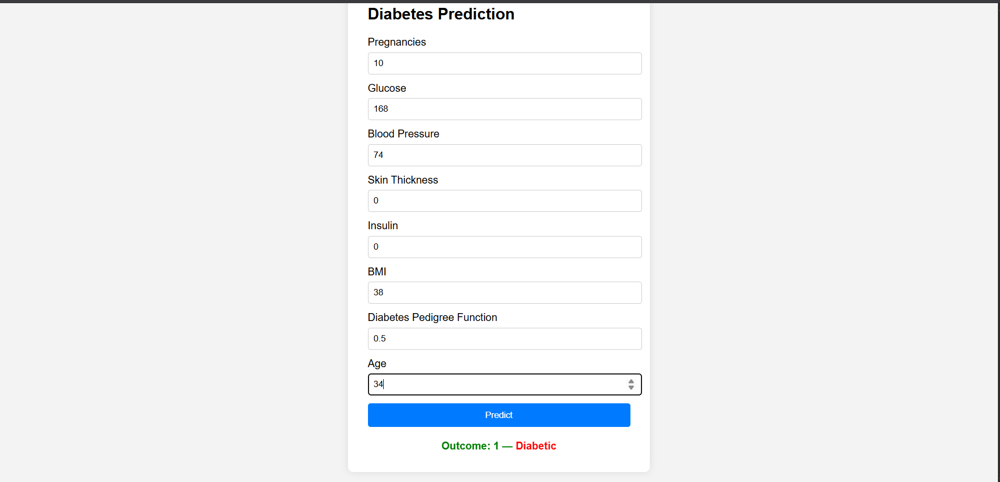

# 🩺 Diabetics Prediction App

A **Machine Learning-based web application** designed to predict whether an individual is likely to have diabetes based on several health parameters. This project uses the **Pima Indians Diabetes dataset**, and serves predictions through a Flask-powered web interface.

> 📍 Built with **Python**, **scikit-learn**, **Flask**, and **HTML**.

---

## 📌 Overview

Early diagnosis of diabetes can significantly reduce the risk of serious complications. This application provides a user-friendly platform for predicting diabetes likelihood using a trained ML model.

Users input 8 health-related parameters, and the system returns a prediction of whether the person is diabetic or not.

---

## 🎯 Objective

The goal of this project is to:
- Build and train a machine learning model using support vector machine Algo on real-world diabetes data.
- Deploy the model via a lightweight web application using Flask.
- Create an interactive frontend that allows non-technical users to get predictions instantly.

---

## 🛠️ Tech Stack

| Component          | Tools / Libraries                      |
|-------------------|-----------------------------------------|
| Language          | Python                                  |
| Framework         | Flask                                   |
| Data Processing   | Pandas, NumPy                           |
| Model Building    | Scikit-learn                            |
| Frontend          | HTML, CSS                               |
| Deployment Ready  | Localhost                               |

---

## 📂 Project Structure

```
Diabeticsapp/
│
├── DiabetesPrediction.ipynb     # Jupyter Notebook for model training and preprocessing
├── app.py                       # Flask application for running the web app
├── diabetes.csv                 # Dataset used for training
├── model.pkl                    # Trained machine learning model (saved via joblib)
├── scaler.pkl                   # Feature scaler for input normalization
├── requirements.txt             # Required Python libraries
├── templates/
│   └── index.html               # HTML form for user input
└── README.md                    # Project documentation
```

---

## 💡 Features

- 🔍 **Predictive Modeling**: Uses a trained ML model to predict diabetes risk.
- 📊 **Data Preprocessing**: Input features are standardized using a pre-fit `StandardScaler`.
- 🌐 **Web Interface**: Built with Flask and HTML for seamless input and prediction.
- 📦 **Modular Codebase**: Clean separation between model, preprocessing, and app logic.

---

## 📊 Dataset Information

- **Dataset**: Pima Indians Diabetes Dataset
- **Source**: [UCI Machine Learning Repository](https://archive.ics.uci.edu/ml/datasets/pima+indians+diabetes)
- **Records**: 768 samples
- **Features**:
  - Number of Pregnancies
  - Glucose Level
  - Blood Pressure
  - Skin Thickness
  - Insulin Level
  - Body Mass Index (BMI)
  - Diabetes Pedigree Function
  - Age

---

## 🧠 Machine Learning Model

- **Algorithm**: Logistic Regression,Support vector machine
- **Scaler**: StandardScaler to normalize input data
- **Evaluation**: Accuracy, Confusion Matrix (evaluated inside notebook)
- **Model Persistence**: Saved using `joblib` as `model.pkl` and `scaler.pkl`

---

## ⚙️ Installation & Running the App

1. **Clone the Repository**
   ```bash
   git clone https://github.com/Mohitderek/Diabeticsapp.git
   cd Diabeticsapp
   ```

2. **Install Required Packages**
   ```bash
   pip install -r requirements.txt
   ```

3. **Run the Flask App**
   ```bash
   python app.py
   ```

4. **Open the App in Browser**
   ```
   http://127.0.0.1:5000
   ```

---

## 🖼️ Screenshots



---

## 🚀 Future Enhancements

- Improve UI with Bootstrap or TailwindCSS
- Add input validations and tooltips for better user experience
- Deploy the app on cloud platforms.
- Add user authentication for saving prediction history

---

## 🤝 Contributions

Contributions, suggestions, and feedback are welcome!  
Feel free to fork the repo, make changes, and submit a pull request.

---

## ✍️ Author

Mohit Derek

📧 [mohitsercha5623@gmail.com]

## 📄 License

This project is licensed under the [MIT License](LICENSE).


